# Lab 3 - Lokalne repozytorium

## 1. Tworzenie repozytorium

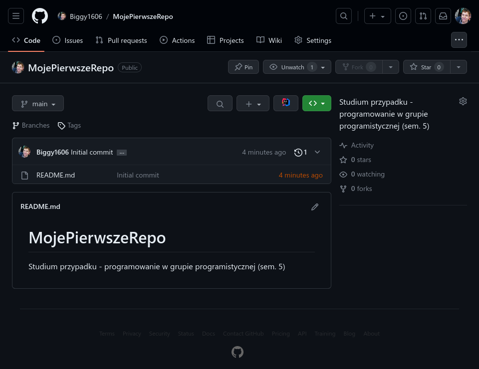

## 2. Dodanie plików

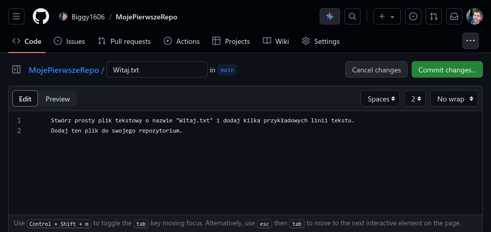

## 3. Tworzenie gałęzi

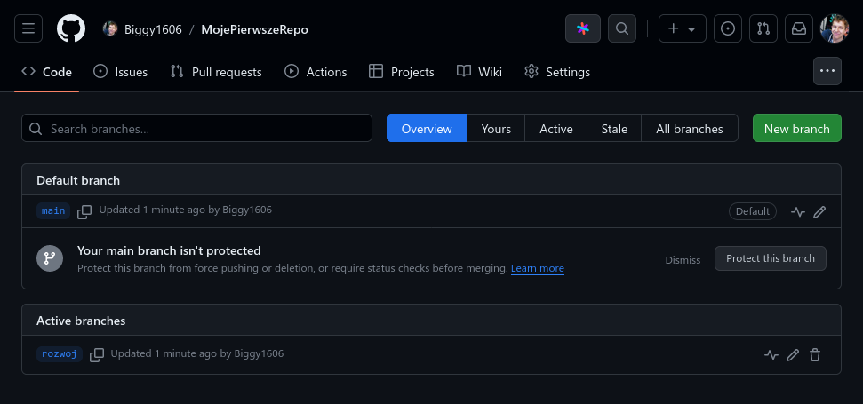
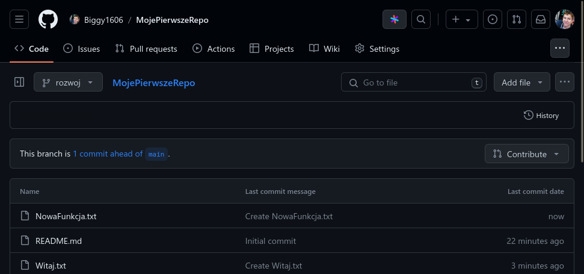

## 4. Zgłoszenie zmian

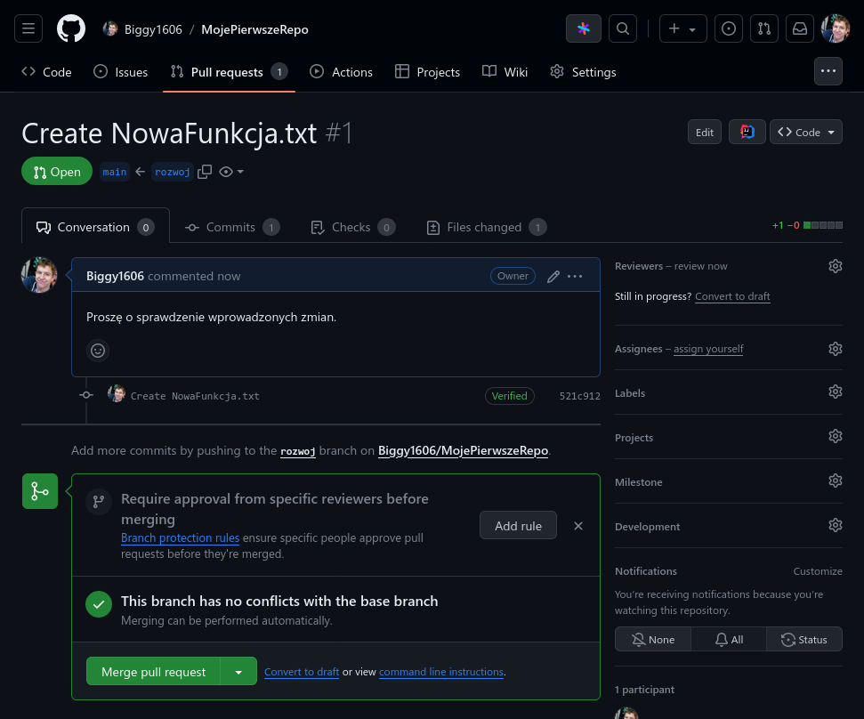

## 5. Recenzja i zatwierdzenie zmian

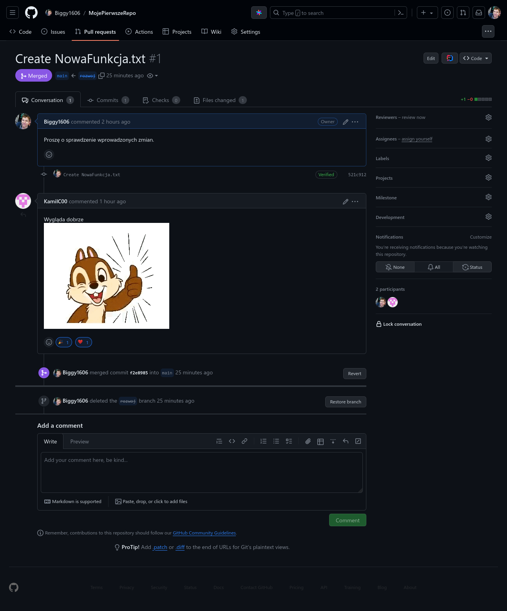

## 6. Aktualizacja lokalnego repozytorium

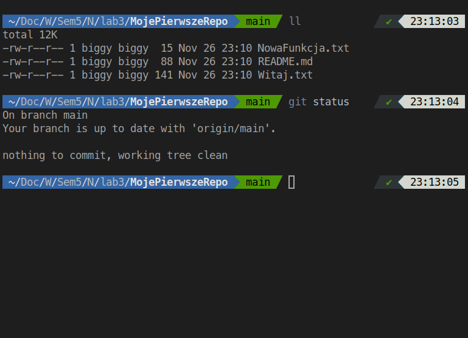

## 7. Rozwiązywanir problemów (issues)

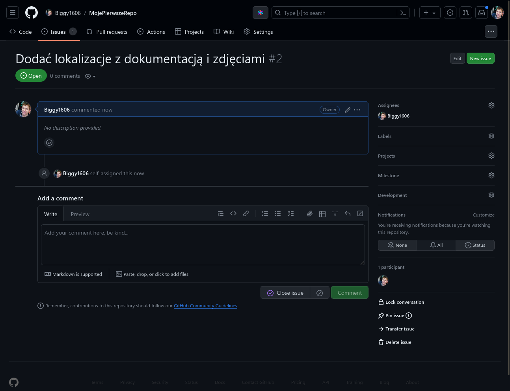

## 8. Wprowadzanie Zmian na Podstawie Issue

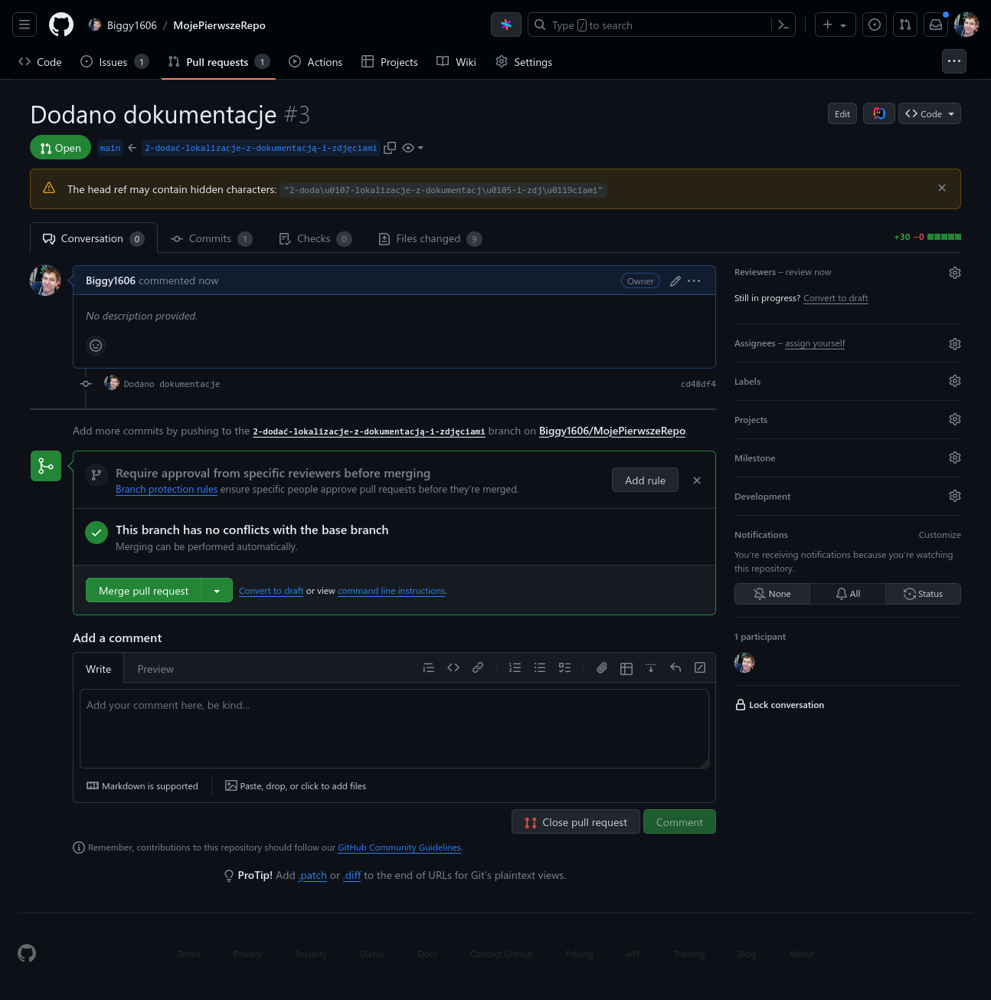
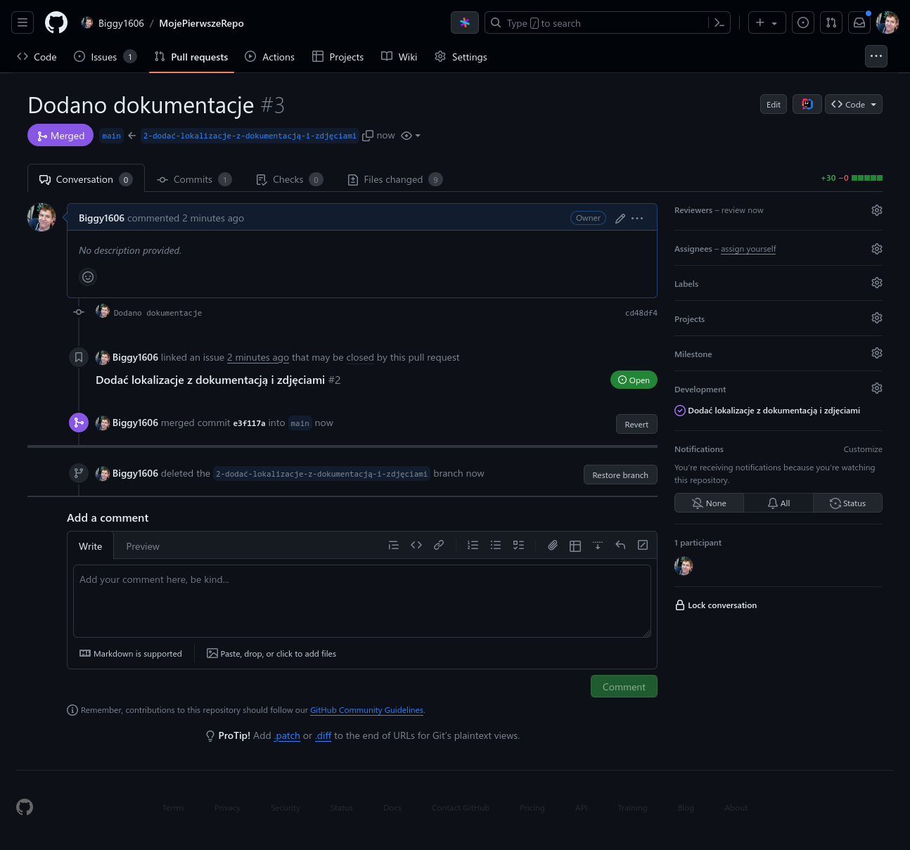

## 9. Współpraca z Innymi

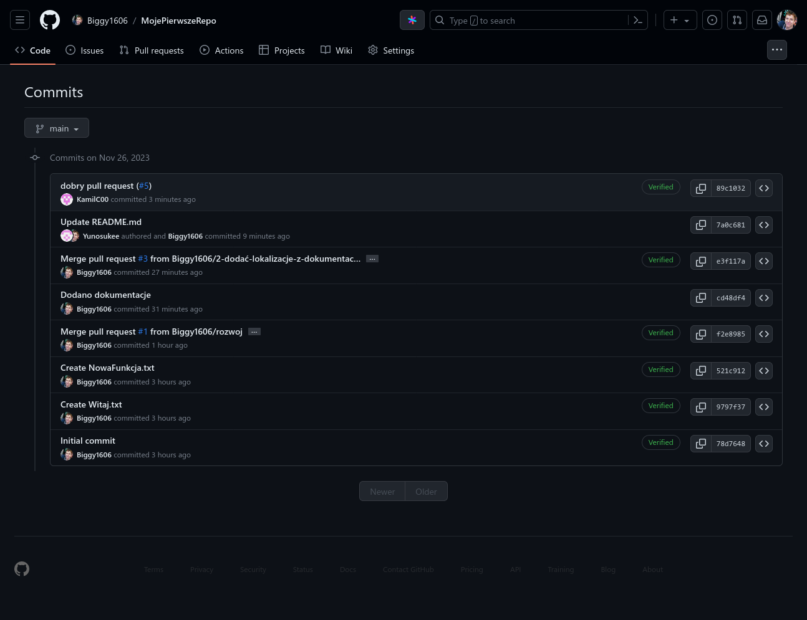
